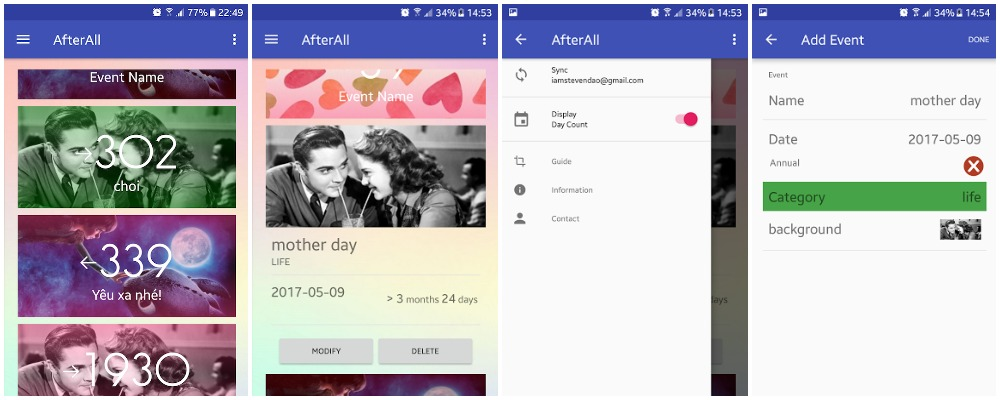

# AfterAll
    

## About
My girl friend was complaining about me forgetting all of our special dates. So I made this app to store, get count and look forward to important dates.  
Currently in beta in Google Store, contact me if you would like to join, everyone is welcome.

## Table of contents
- [Requirements](#requirements)
- [Screenshots](#screenshots)
- [Functionality](#functionality)
- [Credits](#credits)
- [License](#license)

## Requirements
- Android Studio
- Android 4.0 IceCreamSandwich (API lvl 14) or greater (for Folding Cell intergration)
## Screenshots

## Functionality
- Store event's date, get counting day, either in number of dayss or year-month-date format.
- Sync between devices by signing in using Google account.
- Simple and minimal UI, easy to use.
## Credits
- [Folding Cell](https://github.com/Ramotion/folding-cell-android)
- [Floating Action Button](https://github.com/makovkastar/FloatingActionButton)
- [Google Calendar API](https://developers.google.com/google-apps/calendar/)
- [Mobile Sans Font](http://www.dafont.com/mobile-sans.font)
## License
AfterAll is opensource, contribution and feed back are very welcome.  
This project is distributed under [MIT License](https://github.com/Ramotion/folding-cell-android/blob/master/LICENSE.md) as it covers the [FoldingCell](https://github.com/Ramotion/folding-cell-android) and [Floating Action Button](https://github.com/makovkastar/FloatingActionButton) projects.

